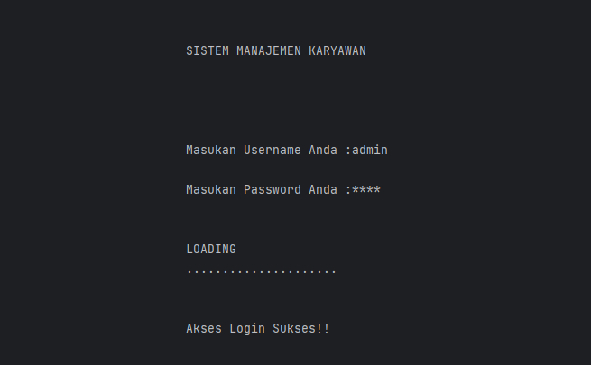
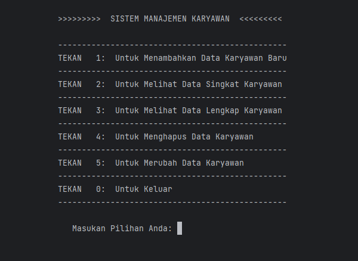

# CRUD Project Managemen Karyawan version 3.0

<p align="center">

</p>

<p align="center">

</p>

<p align="center">
        <a href="https://github.com/cwordtech"></a>
</p>

## Password dan Username:heavy_exclamation_mark:
```
Username = admin
Password = pass
```
<details>

<summary>
        Kalian ingin merubah Username dan Passwordnya?
</summary>

### Kalian pun, bisa menganti Username dan Password pada bagian :
`````````````````````````
```````````````
Views/login.cpp 
```````````````
CRUD_PROJECT_VERSION-3.0
│
└─.idea
└─cmake-build-debug
└─dataBase
└─helper
└─model
└─preview-img-readme
└─views
   └──login.cpp
`````````````````````````
Pada baris code dibawah :
```cpp
//Line 38
   if(pass == "pass" && user =="admin"){
        ....
    }
````
Dengan User name dan Password yang kalian mau.
</details>

## Requirements 
- C++ IDE (Kami rekomend pakai Clion, dari JetBrains)
- Cmake

## Note
 Kami akan membuat versi GUInya dalam waktu dekat, dengan SQL sebagai Data Basenya :wink:

## :speech_balloon: Contact Me
- <a href="https://www.instagram.com/cword.tech/" target="_blank">Instagram</a>